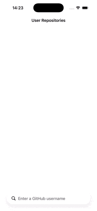
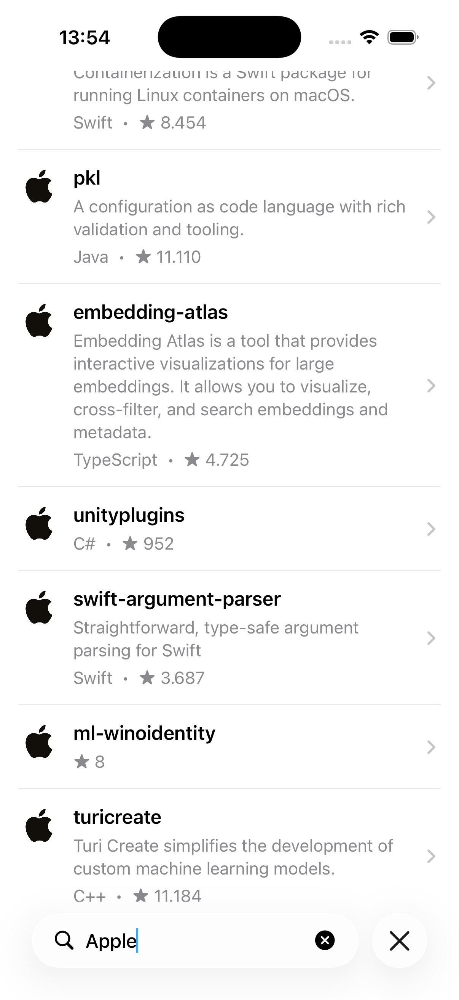
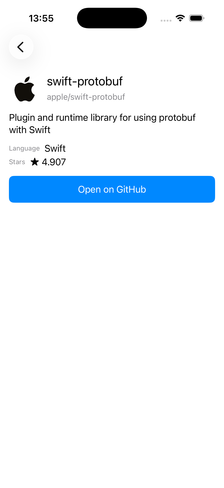

# GitHubSearch

GitHubSearch is an iOS app for searching public GitHub repositories by username. It is built with UIKit using MVVM with Coordinators, RxSwift/RxCocoa for reactive bindings, and the GitHub REST API for data fetching.

The app focuses on a clear search flow: type a username, browse paginated repositories, and open a dedicated details screen for a selected repository.

## Screenshots

| Demo | Search | Results | Details |
|------|--------|---------|---------|
|  |  |  |  |

## Architecture

The project uses `MVVM + Coordinator` to keep presentation logic, view code, and navigation responsibilities separate.

- `ViewControllers` handle UIKit layout, bindings, and rendering UI state.
- `ViewModels` transform inputs into outputs and own screen state.
- `Coordinators` manage navigation so screen transitions do not leak into view controllers.
- `Services` isolate networking and image loading concerns behind small protocols.

RxSwift/RxCocoa is used to model user input and async events as observable streams. In this project it keeps the search flow predictable: text input, debounced requests, pagination triggers, and UI state updates are all expressed as one-way data flow instead of scattered delegate callbacks and mutable UI logic.

## Features

- Search repositories by GitHub username
- Debounced search input
- Pagination with infinite scroll
- Repository details screen
- Remote image loading with in-memory caching
- Request deduplication for concurrent image loads
- User-friendly error messages
- Localization through `L10n`
- Accessibility identifiers and labels for key UI elements

## Key Decisions

### Debounce strategy

Search input is trimmed, deduplicated, and debounced before the initial request is made. Empty input is handled immediately to reset the screen back to a prompt state without waiting for the debounce interval.

The goal was to reduce unnecessary API calls while keeping the UI responsive. A simple fixed debounce is enough for this use case and keeps the behavior easy to reason about and test.

### Pagination approach

Pagination is intentionally simple. The `SearchViewModel` tracks:

- current query
- current page
- accumulated repositories
- whether another page exists
- whether a page request is already in progress

The next page is requested when the list is scrolled near the end. The GitHub `Link` header is used to determine whether another page exists. There is no generic pagination abstraction because the app only has one paginated flow, and a local, screen-specific implementation keeps the code smaller and easier to maintain.

### State handling in `SearchViewModel`

`SearchViewModel` exposes a focused `ViewState` for rendering:

- `prompt`
- `loading`
- `results`
- `empty`
- `failure`

This keeps view rendering explicit and avoids spreading conditional UI logic across the view controller. Search results and error messages are also exposed as separate streams, which allows the screen to preserve already loaded results when a later pagination request fails.

### Image loading

Image loading is implemented as a dedicated service with two practical optimizations:

- `NSCache` stores previously loaded images in memory
- in-flight request deduplication ensures that concurrent requests for the same URL share one network task

This is enough for an app of this size and avoids bringing in a third-party image pipeline when the required behavior is limited to avatar loading.

## Error Handling

The networking layer maps common failure cases to user-facing messages:

- invalid input
- missing user (`404`)
- connectivity issues
- GitHub rate limiting (`403`)
- unknown or decoding failures

The search screen presents errors in an alert and only switches to a failure state on the initial load. If a later page request fails, the current results remain visible and the user still receives feedback. This keeps the failure behavior less disruptive during pagination.

## Testing

The project includes unit tests for the areas with the most application logic:

- `SearchViewModel`
- pagination behavior
- `GitHubService`
- `ImageLoader`
- `RepoDetailsViewModel`

`RxTest` is used for deterministic testing of reactive streams such as debounced input and pagination timing. `RxBlocking` is used where blocking assertions are a better fit, particularly for service-level tests.

The tests focus on behavior that is easy to regress:

- debounce behavior and empty-input reset
- appending and resetting paginated results
- preventing duplicate page loads while a request is in flight
- mapping API and connectivity errors
- image caching, cancellation, MIME validation, and request deduplication
- formatting and fallback behavior in the details screen view model

## Trade-offs

Some decisions were intentionally kept conservative:

- No generic pagination abstraction. There is a single paginated flow, so a screen-specific implementation is easier to follow.
- No offline persistence or repository cache. The app reads directly from the GitHub API and keeps only in-memory image cache.
- No external image library. The custom image loader covers the required behavior without adding more dependencies.
- No broader data layer abstraction beyond what the current scope needs. Protocol boundaries exist where they support testing and separation of concerns.

These choices keep the project focused on a clean implementation of the core search experience instead of adding architecture that the app does not yet need.

## Tech Stack

- UIKit
- MVVM + Coordinator
- RxSwift / RxCocoa
- GitHub REST API
- SnapKit
- XCTest
- RxTest
- RxBlocking
- CocoaPods

## How to Run

1. Install dependencies:

```bash
pod install
```

2. Open the workspace:

```bash
open GithubSearch.xcworkspace
```

3. Build and run the `GithubSearch` scheme in Xcode.

To run tests, use the `GithubSearchTests` target from Xcode.
